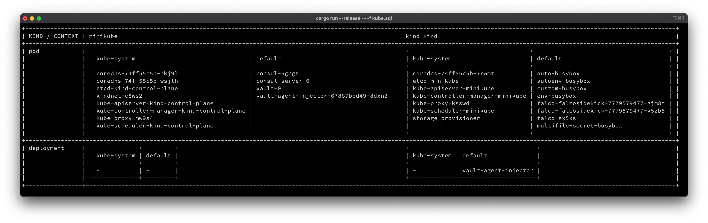

<p align="center"><a href="https://github.com/Dentrax/kubesql" target="_blank"></a></p>

<h1 align="center">kubesql</h1>

<div align="center">
 <strong>
   An experimental tool for querying your Kubernetes API Server using SQL
 </strong>
</div>

<br />

<p align="center">
  <a href="https://opensource.org/licenses/MIT"></a>
  <a href="https://github.com/Dentrax/kubesql/releases/latest"></a>
</p>

<br />

*kubesql*, an experimental tool for querying your Kubernetes API Server using simple and smallest SQL syntax.



# Installation

```bash
$ cargo install --path . # local
# - or -
$ cargo install --git https://github.com/Dentrax/kubesql # remote
```

# Usage

```bash
USAGE:
    kubesql [OPTIONS]

FLAGS:
    -h, --help       Prints help information
    -V, --version    Prints version information

OPTIONS:
    -f, --file <FILE>      
    -q, --query <query>
```

## Evaluate
```bash
$ kubesql --file ./kube.sql
$ kubesql --query "SELECT namespace FROM context WHERE pod.status.phase = 'Running'"
```

# Quick Start

## SQL Syntax

### Single Context
```sql
SELECT namespace
FROM context
WHERE pod.status.phase = 'Running'
```

### Multiple Context-Namespace
```sql
SELECT namespace1, namespace2
FROM context1, context2
WHERE pod.status.phase = 'Running' AND deployment.metadata.name = 'my-awesome-deployment'
```

### Supported Statements
| STATEMENT | REQUIRED |
|-----------|----------|
| SELECT    | ✓        |
| FROM      | ✓        |
| WHERE     | ✓        |

### Supported Operators
| OPERATOR | WHERE | ACTION                   |
|----------|-------| ------------------------ |
| AND      | ✓     | Panic if no result found |
| OR       | ✓     | Continue                 |

## License

*kubesql* was created by Furkan 'Dentrax' Türkal

The base project code is licensed under [MIT](https://opensource.org/licenses/MIT) unless otherwise specified. Please see the **[LICENSE](https://github.com/Dentrax/kubesql/blob/master/LICENSE)** file for more information.

<kbd>Best Regards</kbd>